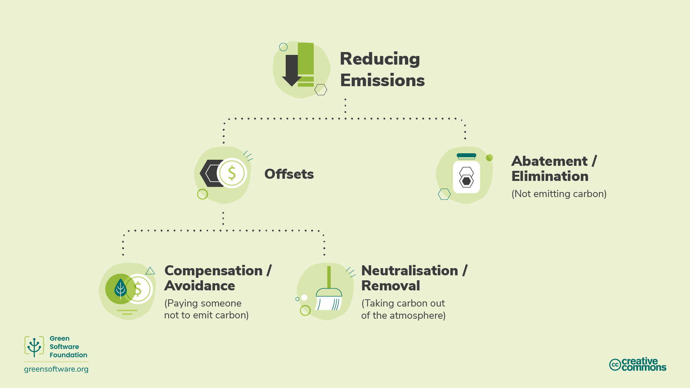
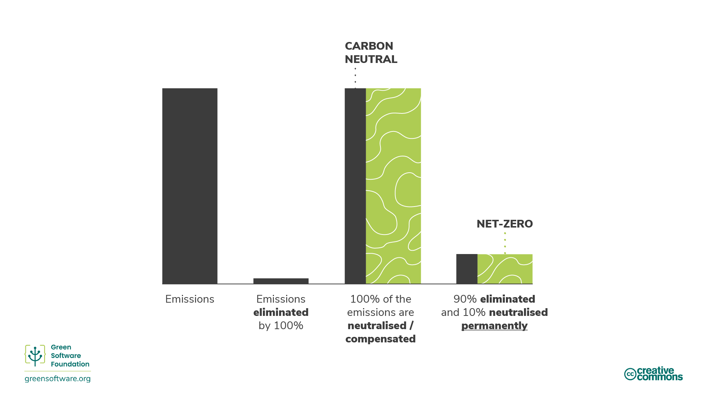
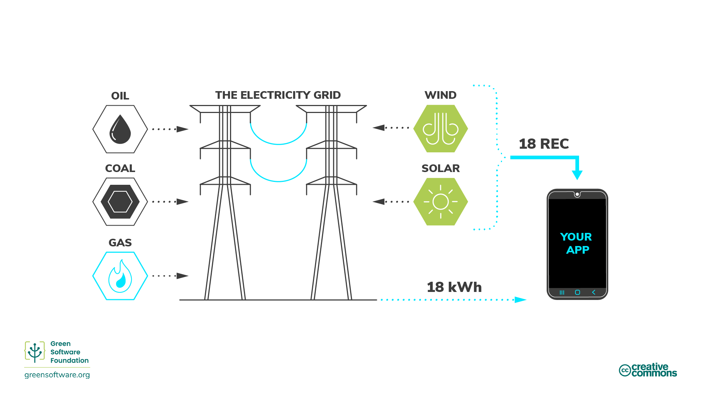
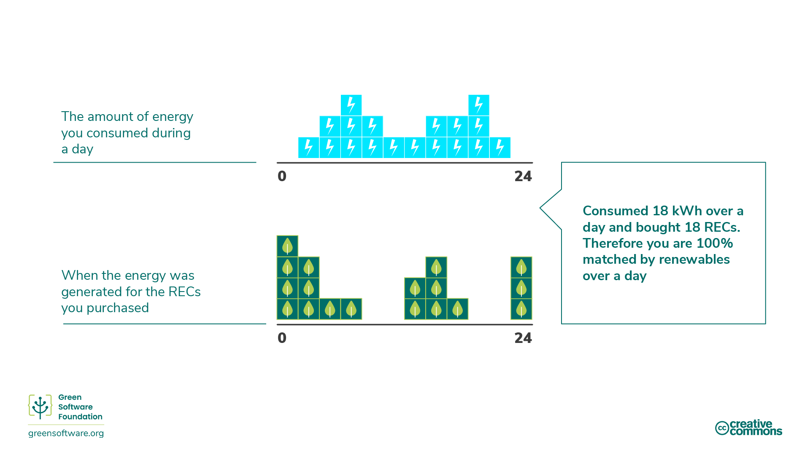
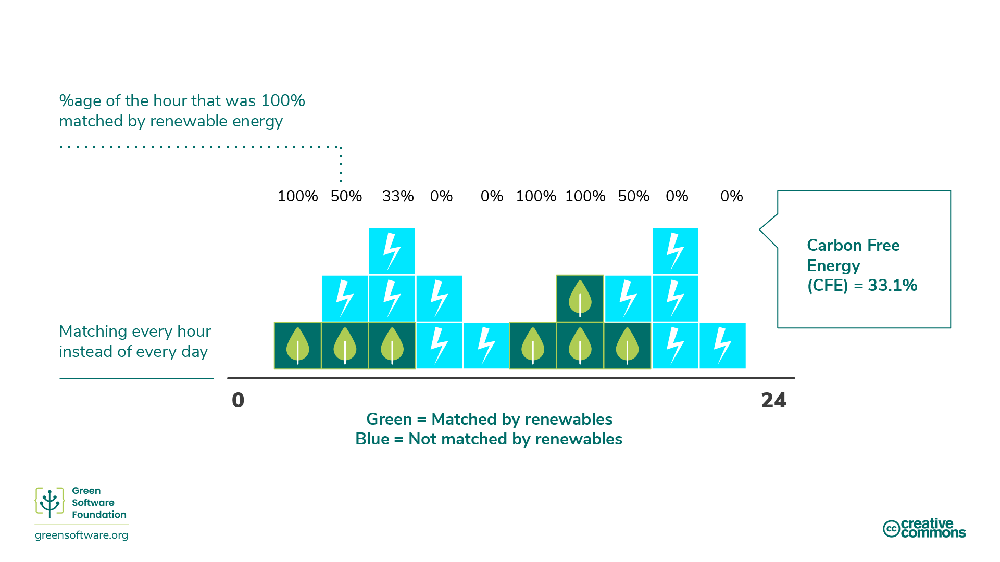
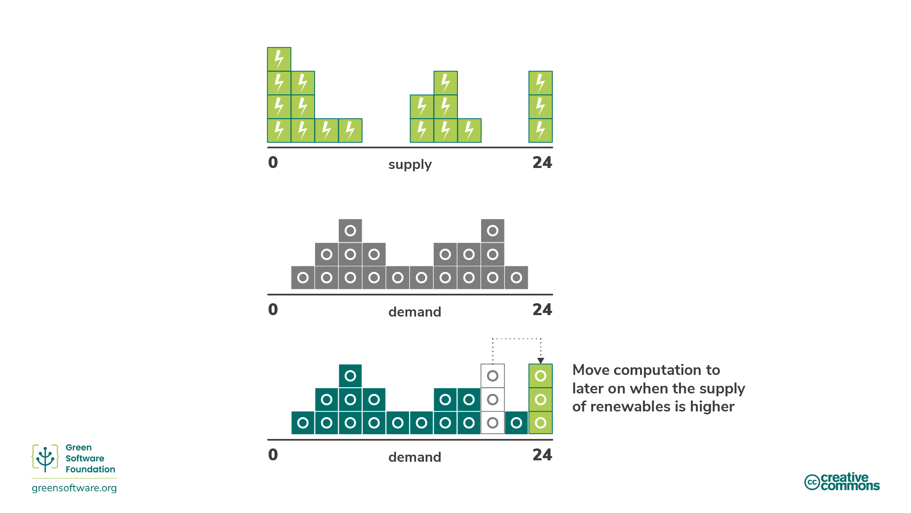

import Quiz from "/src/components/Quiz";

:::note
Đây là bản dịch cộng đồng đóng góp. Nó có sự hỗ trợ hạn chế và có thể không phù hợp với phiên bản tiếng Anh mới nhất của khoá học.
:::

:::tip Tiêu chuẩn

_Hiểu cơ chế chính xác của quá trình khử cacbon._

:::

## Giới thiệu

Trong những năm gần đây, nhiều tác nhân kinh tế đã tìm cách đạt được các mục tiêu khí hậu khác nhau bằng cách thực hiện các cam kết khác nhau.

Các thuật ngữ "không có", "khí carbon trung tính", "có khí thải carbon" và "khối hậu trung tính" đã được sử dụng thay thế cho nhau với mục tiêu chính để loại bỏ, giảm và ngăn chặn khí thải cacbon. Khi sự quan tâm đến các mục tiêu này tăng lên, điều cần thiết là phải có sự hiểu biết chung về ý nghĩa của chúng và làm thế nào để đạt được chúng thông qua các chiến lược và quy trình đo lường mà chúng ta đã học được.

## Các phương pháp giảm thiểu carbon

Có nhiều cách để giảm lượng khí thải, nhưng điều quan trọng là bạn phải hiểu cơ chế chính xác của quá trình giảm khi nghĩ về mục tiêu giảm.

### Abatement / Carbon Elimination

[Sciencebased Targets Initiative](https://sciencbasedtargets.org/) đề cập đến một cơ chế gọi là [abatement]( https://sencebasetargets/org/resources/legacy/2020/09/foundations-for-net-zero-executive-summary.pdf), có nghĩa là loại bỏ các nguồn khí thải CO2 liên quan đến hoạt động của một công ty và [chuỗi giá trị](http://www.cisl.cam.ac.uk/education/graduate-study/pgcerts/value-chain-defs) để chúng không xâm nhập vào bầu khí quyển. Chuỗi giá trị mô tả toàn bộ phạm vi hoạt động cần thiết để tạo ra một sản phẩm hoặc dịch vụ, từ quan niệm đến phân phối. Điều này bao gồm tăng hiệu quả năng lượng để loại bỏ một số lượng khí thải liên quan đến việc tạo ra năng lượng.

Việc giảm bớt lượng khí thải không đủ vì sẽ luôn có một số lượng khí không thể được loại bỏ do những hạn chế về công nghệ hoặc kinh tế, nhưng nó phải là cốt lõi của chiến lược của mỗi tổ chức vì nó là một lĩnh vực mà hầu hết mọi công ty đều có thể cải thiện.

Để cân bằng lượng khí thải còn lại, chúng ta cần xem xét các cơ chế khác như bù đắp, bồi thường hoặc trung hoà.

### Offsets

[Offsets](https://www.offsetguide.org/understanding-carbon-offsets/what-is-a-carb-offset/) là những khoản đầu tư trực tiếp vào các dự án giảm phát thải thông qua việc mua các khoản tín dụng carbon trên thị trường carbon tự nguyện (VCM). VCM là một thị trường phi tập trung nơi các chủ thể tư nhân tự nguyện mua và bán các khoản tín dụng carbon đại diện cho việc loại bỏ hoặc giảm GHG được chứng nhận khỏi khí quyển.

Để bù đắp lượng khí thải, bạn cần phải mua một khối lượng tương đương các bon tín dụng để bù cho những carbon phát thải, trong đó 1 carbon tín dụng tương ứng với 1 tấn CO2 được hấp thụ hoặc giảm.

Nhiều lợi ích tích cực có thể xuất phát từ các dự án này, từ bảo vệ hệ sinh thái đến trao quyền cho cộng đồng địa phương. Tuy nhiên, để đảm bảo các chương trình này được thực hiện chính xác và có tác động mong muốn đối với môi trường và mục tiêu đạt được mức 0 trên toàn thế giới, có những tiêu chuẩn toàn cầu mà chúng phải đáp ứng như Tiêu chuẩn Carbon được xác minh (VCS) và Tiêu chuẩn Vàng (GS).

#### SCI and Offsets

Có một số hạn chế đối với cácbon bù và đó là lý do tại sao chúng không được xem xét trong điểm SCI của một tổ chức. Ví dụ, tưởng tượng hai ứng dụng, cả hai đều chạy trên nền tảng đám mây được bù đắp bằng 100% carbon và được kết hợp 100% bằng năng lượng tái tạo. Ứng dụng A đã đầu tư thời gian và tài nguyên đáng kể để đảm bảo rằng nó đang sử dụng tài nguyên hiệu quả, trong khi ứng dụng B sử dụng các tài nguyên rất không hiệu quả. Để SCI trở thành một thước đo hữu ích, ứng dụng A cần có điểm cao hơn ứng dụng B.

Nếu SCI xem xét bù đắp, cả hai đơn sẽ có điểm 0. Điều này không cho chúng ta biết họ sử dụng tài nguyên hiệu quả đến mức nào. Mặc dù ứng dụng B đang thải ra nhiều phân tử carbon vào khí quyển, vì điểm số của nó là 0 và điểm số thấp nhất là 0, tại sao nó lại đầu tư nhiều hơn vào việc cải thiện hiệu quả carbon của nó?

Các tổ chức cần có kế hoạch về cách loại bỏ cũng như trung hoà khí thải và SCI giúp họ điều khiển việc loại bỏ khí thải do phần mềm. Điều này làm cho SCI trở thành một thành phần thiết yếu của bất kỳ chiến lược ròng không nào.

### Compensating / Carbon Avoidance

[Bảo hiểm](https://www.abatable.com/blog/carbon-removal-vs-carbon–avoidance-projects) là những hành động mà các công ty thực hiện để giúp xã hội tránh hoặc giảm phát thải bên ngoài chuỗi giá trị của họ. Điều này về cơ bản là đầu tư vào các dự án giảm bớt của các tổ chức khác.

Điều này bao gồm các hành động như:

- ** Bảo quản** - Các tín dụng được tạo ra dựa trên carbon không được giải phóng thông qua việc bảo vệ cây cổ.
- ** Dự án cộng đồng** - Những dự án này giúp đỡ các cộng đồng trên toàn thế giới, chủ yếu là những người chưa phát triển, bằng cách giới thiệu các phương pháp sống bền vững.
- **Chất thải thành năng lượng** - Những dự án này thu khí metan/chất thải đất ở những ngôi làng nhỏ hơn, chất thải của con người hoặc nông nghiệp, và chuyển đổi nó thành điện.

### Neutralizing / Carbon Removal

[Chủ nghĩa trung hoà](https://www.abatable.com/blog/carbon-removal-vs-carbon–avoidance-projects) là những hành động mà các công ty thực hiện để loại bỏ carbon khỏi khí quyển trong hoặc ngoài chuỗi giá trị của họ. Sự trung hoà đề cập đến việc loại bỏ và lưu trữ vĩnh viễn cacbon trong khí quyển để cân bằng tác động của việc thải ra CO2 vào khí quyển. Điều này bao gồm các hành động như:

- **Enhancing natural carbon sinks** - loại bỏ CO2 khỏi khí quyển. Ví dụ, phục hồi rừng, vì quang hợp loại bỏ CO2 một cách tự nhiên. Mở rộng rừng đi kèm với những thách thức vì điều cần thiết là không ảnh hưởng đến động lực của đất nông nghiệp và nguồn cung cấp lương thực ở nơi khác. Các phương pháp canh tác hiện đại cũng có thể kéo dài thời gian carbon còn lại trong đất.
- **Direct air capture** là quá trình thu nạp CO2 từ không khí và lưu trữ nó vĩnh viễn, dưới lòng đất hoặc trong các sản phẩm tồn tại lâu dài như bê tông.

Hiệu quả của các phương pháp này thường được đo lường dựa trên việc liệu chúng có thể cung cấp việc loại bỏ carbon ở quy mô và tốc độ cần thiết hay không.

Khi nói đến các dự án loại bỏ carbon, độ bền là một cân nhắc quan trọng. Độ bền của một dự án mô tả thời gian carbon dioxide sẽ được giữ lại khỏi khí quyển.

Thời lượng ngắn hạn lên tới 100 năm, trung hạn là 100 đến 1.000 năm, và dài hạn là hơn 1.000 năm.

- Các giải pháp dựa vào chu trình cacbon tự nhiên của Trái đất có độ bền ngắn hạn được đo bằng nhiều thập kỷ. Ví dụ, các dự án lâm nghiệp có thời gian tồn tại từ 40 đến 100 năm.
- Các giải pháp kỹ thuật như thu khí trực tiếp thường có độ bền dài hạn được đo trong thiên niên kỷ. Ví dụ, chụp không khí trực tiếp có độ bền 10.000 năm.
- Các dự án dài hạn thường đắt hơn các dự án ngắn hạn. Khi thải ra, carbon vẫn còn trong khí quyển trong 5.000 năm. Để được coi là không ròng, các bon đã được phát thải cần phải được loại bỏ vĩnh viễn.

Một dự án tách carbon ngắn hạn sẽ chỉ tách cacbon trong 100 năm, sau đó nó sẽ quay trở lại bầu khí quyển làm trái đất ấm lên. Đây là một trong những lý do tại sao giảm nhẹ được ưa thích hơn là trung hoà. Không bao giờ giải phóng cacbon tốt hơn nhiều so với việc giải phóng các bon và sau đó cố gắng giữ nó khỏi bầu khí quyển trong 5.000 năm.

## Climate commitments

Có nhiều chiến lược giảm khí hậu khác nhau mà một tổ chức có thể cam kết, từ carbon trung tính đến không. Hiểu được ý nghĩa và ý nghĩa khác nhau của từng ý nghĩa có thể giúp bạn quyết định chiến lược phù hợp cho tổ chức của mình.

### Carbon Neutral

Để đạt được tính trung hoà carbon, một tổ chức phải đo lường lượng khí thải của mình, sau đó khớp tổng số với các khoản bù lượng khí phát thải của nó thông qua các dự án giảm carbon. Điều này có thể bao gồm các dự án loại bỏ carbon (trung lập) và các dự thảo tránh carbon (bù đắp).

Tính trung hoà carbon được định nghĩa bởi một tiêu chuẩn được quốc tế công nhận: [PAS 2060](https://info.eco-act.com/hubfs/0%20-%20Downloads/PAS%202060/Pas%202060%20%20factsheet%20EN.pdf). Mặc dù điều này khuyến cáo một tổ chức đặt mục tiêu giảm thiểu, nhưng nó không yêu cầu họ giảm lượng khí thải. Vì vậy, được coi là carbon trung tính, một tổ chức có thể chỉ đo lường và bù đắp mà không đầu tư các nguồn lực để loại bỏ khí thải carbon của họ.

Để carbon trung tính, bạn phải bao gồm lượng khí thải trực tiếp (cấp 1 và 2). Ước tính chung là các tổ chức đo lường và bù lại phạm vi 1 và 2 của họ và du lịch kinh doanh từ phạm vi 3. Tuy nhiên, không có yêu cầu cụ thể nào để bao gồm điều đó.

Carbon trung tính là bước đầu tiên quan trọng đối với bất kỳ tổ chức nào vì nó khuyến khích đo lường. Tuy nhiên, không có đủ các khoản bù lượng carbon trên thế giới để bù đắp lượng khí thải của tất cả các tổ chức. Do đó, bất kỳ chiến lược nào không bao gồm giảm bớt sẽ không mở rộng hoặc giúp thế giới đạt được mục tiêu 1.5 độ được thiết lập bởi Hiệp định Khí hậu Paris. Đây là nơi mà net-zero được sử dụng.

### Net Zero

Zero có nghĩa là giảm phát thải theo khoa học khí hậu mới nhất và cân bằng lượng phát thải còn lại thông qua việc loại bỏ carbon (trung hoà). Về định nghĩa, không ròng đòi hỏi phải giảm lượng khí thải theo con đường 1,5°C. Tất cả các doanh nghiệp phải làm điều này để đạt được lượng khí thải toàn cầu bằng 0 vào năm 2050.

Phân biệt quan trọng giữa không ròng và trung tính carbon là trọng tâm của không rổ là giảm bớt thay vì trung hoà và bù. Mục tiêu 0 là nhằm loại bỏ khí thải và chỉ bù đắp cho lượng khí thải còn lại mà bạn không thể loại bỏ

[Tiêu chuẩn cho mục tiêu zero](https://sciencebasedtargets.org/resources/files/foundations-for-net-zero-full-paper.pdf) đang được phát triển bởi [Science Based Targets initiative] (SBTi). Họ tính toán rằng có 66% xác suất hạn chế sự nóng lên toàn cầu xuống còn 1,5 °C nếu chúng ta đạt đến mức giảm khoảng 90% tổng lượng khí thải GHG vào giữa thế kỷ. Vậy, để đạt được mục tiêu 0%, một tổ chức cần loại bỏ 90% lượng khí thải vào năm 2050. Các lượng khí thải còn lại chỉ có thể được bù đắp bằng cách trung hoà và loại bỏ carbon vĩnh viễn.

Một chiến lược bằng không có nghĩa là lượng carbon thực sự trong khí quyển vẫn không đổi.

Ngoài ra, để trở thành mục tiêu không ròng, bạn phải bao quát trực tiếp và gián tiếp, tức là. phát thải chuỗi cung ứng (cách nhìn 1,2 và 3). Do đó, toàn bộ chuỗi giá trị cần được bao gồm trong phạm vi mục tiêu 0. Điều này rất đáng kể vì phạm vi 3 thường đại diện cho phần lớn lượng khí thải.

#### SCI là một phần của chiến lược Net-Zero

SCI là một số liệu được thiết kế đặc biệt để loại bỏ khí thải. Cách duy nhất để giảm điểm số là đầu tư thời gian và nguồn lực vào các hoạt động nhằm loại bỏ khí thải. Hoạt động duy nhất mà SCI công nhận là hành động loại trừ là làm cho ứng dụng của bạn tiết kiệm năng lượng hơn, tiết kiệm phần cứng hơn, hoặc tiêu thụ năng lượng ít carbon hơn. Các lợi thế là một thành phần thiết yếu của bất kỳ chiến lược khí hậu nào; tuy nhiên, các lợi thế không phải là loại bỏ và do đó không được đưa vào số liệu SCI.

Bất kỳ chiến lược ròng 0 nào cũng cần có kế hoạch về cách loại bỏ cũng như trung hoà khí thải. SCI giúp các tổ chức thúc đẩy việc loại bỏ khí thải do phần mềm. Điều này làm cho SCI trở thành một thành phần thiết yếu của bất kỳ chiến lược ròng không nào.

### 100% Renewable

Khi các tổ chức đặt mục tiêu 100% năng lượng tái tạo, họ có thể phân biệt giữa việc được **matched by** với **powered by**.

**Powered by** nghĩa là bạn được cung cấp trực tiếp năng lượng từ một nguồn năng lượng tái tạo, ví dụ như một đập thuỷ điện. Trong trường hợp này, các electron chảy vào thiết bị chỉ có thể đến từ nguồn đó, vì vậy bạn có thể tự tin nói rằng bạn được cung cấp 100% năng lượng từ năng lượng tái tạo.

Đối với hầu hết mọi người, chúng ta sống trên một mạng lưới kết nối với nhau, với nhiều nhà sản xuất bơm điện vào và nhiều người tiêu dùng lấy điện ra. Điều này có nghĩa là các electron đi vào thiết bị là hỗn hợp của tất cả các electron vào lưới điện. Ví dụ, giả sử mạng lưới chỉ có 5% nguồn cung cấp gió. Bạn sẽ có 5% electron sinh ra từ gió và 95% electron sinh từ nhiên liệu hoá thạch.

Bạn không thể theo dõi từng electron. Khi các electron từ một trang trại gió được đặt trên một mạng lưới, tất cả chúng trộn lẫn với các electron của một nhà máy nhiên liệu hoá thạch. Vì vậy không có cách nào để một người tiêu dùng nhấn mạnh rằng các electron mà họ sử dụng chỉ đến từ các nguồn tái tạo.

#### Renewable Energy Certificates (REC)

<!--  -->

Để giải quyết vấn đề này, một nhà máy có thể tái tạo bán được hai thứ. Đầu tiên là điện, nó bán thành một mạng lưới điện. Thứ hai là REC, một [Chứng nhận năng lượng tái tạo](https://www.epa.gov/green-power-markets/renewable-energy-certificates-recs). 1 REC bằng 1 kWh năng lượng.

Nếu bạn muốn được kết hợp 100% bởi năng lượng tái tạo và đang trong quá trình lắp ráp, giải pháp là mua đủ các thiết bị thu hồi năng lượng để có thể chi trả lượng điện tiêu thụ. Ví dụ, nếu bạn tiêu thụ 100 kWh điện mỗi ngày, thì để có thể tái tạo được 100%, bạn sẽ mua 100 REC.

Khi các tổ chức đặt mục tiêu 100% có thể tái tạo để mua REC trên thị trường là giải pháp mà họ thường sử dụng để đáp ứng cam kết của họ.

#### PPAs

Bạn cũng có thể nghe thuật ngữ PPA được sử dụng cùng với RECs. PPA là một [Hiệp định mua sắm quyền lực](https://ppp.worldbank.org/public-private-partnership/sector/energy/energie-power-agreements/powerpurse-agreement), đây là một cách khác để mua RECs. Nếu ước tính cần 500 MW điện mỗi năm cho một trung tâm dữ liệu cụ thể, bạn có thể ký kết hợp đồng thu mua 500 MW / năm từ nhà máy có thể tái tạo. Sau đó, bạn sẽ có tất cả các REC liên quan đến nhà máy điện này.

PPA thường là hợp đồng dài hạn. Một nhà máy tái tạo có thể tìm được tài chính với một trong những thoả thuận này vì nó đã có người mua điện trong nhiều năm.

PPA khuyến khích một cái gì đó được gọi là **additionality**. Việc mua một PPA thúc đẩy việc tạo ra các nhà máy tái tạo mới. PPA là giải pháp giúp chúng ta hướng tới tương lai nơi mọi người đều có thể tiếp cận 100% năng lượng tái tạo.

### 24/7 Hourly Matching

Khi nói đến 100% yêu cầu tái tạo, câu hỏi quan trọng là, độ phân giải của sự phù hợp là gì? Bạn có tổng kết và tách rời hàng năm, hàng tháng, hàng tuần, hàng ngày hoặc hàng giờ? Câu hỏi đó là cần thiết bởi vì để thực sự chuyển đổi sang năng lượng tái tạo chúng ta cần 100% năng lượng đến từ các nguồn năng lượng ít carbon như năng lượng có thể tái tạo 100% thời gian. Sự kết hợp hạt mịn này thường được gọi là [24/7 giờ] (https://www.epa.gov/green-powermarkets/247-hour-matching-electricity)_.

Kết nối 24/7 là một trong nhiều chiến lược chúng ta cần áp dụng để giúp đẩy nhanh quá trình chuyển đổi sang mạng lưới điện tái tạo 100%. Ví dụ, [Google](https://sustainability.google/progress/energy/) và [Microsoft]( https://blogs.microsoft.com/blog/2021/07/14/made-to-measure-sustained-commitment-progress-and-updates/) đều cam kết sẽ được cập nhật 24/7 / giờ vào năm 2030.

#### Daily vs hourly matching

Hãy tưởng tượng một tổ chức có đường cong nhu cầu như thế này, mỗi ô vuông màu xanh biểu thị 1 kWh:

Họ đã mua các REC từ một trang trại gió tạo ra điện với một đường cong, vì vậy mỗi ô vuông màu xanh lá cây đại diện cho 1 REC. Kết hợp theo ngày có nghĩa là tổ chức đã tiêu thụ 18 kWh và mua 18 REC. Kết quả là họ đã đạt mức 0. Họ có thể nói rằng chúng là 100% khớp với năng lượng tái tạo hàng ngày.

Tuy nhiên, nếu chúng ta nhìn vào nó theo từng xô hàng giờ (mỗi ô ở đây có chiều dài 2 giờ), thì nó có vẻ hơi khác:

Tổng lượng năng lượng tiêu thụ vẫn là 18 kWh. Tuy nhiên, chỉ có vài giờ trong ngày mà chúng ta được kết hợp 100% bởi năng lượng tái tạo cho giờ đó. Vì vậy, trong vài giờ, chúng ta có nhiều năng lượng tái tạo hơn là chúng ta cần. Ngược lại, chúng ta có ít năng lượng tái tạo hơn so với hầu hết thời gian.

Trong ví dụ trên, chúng là **100% khớp với năng lượng tái tạo trên cơ sở hàng giờ chỉ trong 6 giờ trong ngày**.

#### Carbon-free energy

Con số chúng ta sử dụng để mô tả mức độ thành công của chúng ta ở 24/7 hàng giờ là tỷ lệ phần trăm năng lượng không carbon.

Năng lượng không carbon được định nghĩa là [tỷ lệ trung bình năng lượng không có carbon được tiêu thụ ở một địa điểm cụ thể theo giờ](https://cloud.google.com/sustainability/region-carbon#understanding).

Ví dụ trên, nếu đo bằng cách sử dụng kết hợp hàng ngày, chúng ta sẽ được kết hợp 100% với năng lượng tái tạo. Tuy nhiên, chúng tôi chỉ có 33,1% nếu được đo bằng cách sử dụng kết quả theo giờ. **The CFE percentage is, therefore, 33.1%**.

#### Carbon Awareness as part of a 24/7 Hourly Matching Strategy

Máy tính nhận biết carbon liên quan đến việc đáp ứng các tín hiệu cường độ carbon điện và thay đổi hành vi của phần mềm, vì vậy nó phát ra ít carbon hơn. Nhận thức về carbon cũng giúp một tổ chức đạt được mục tiêu phù hợp 24/7 hàng giờ và tăng tỷ lệ CFE của nó.

Một ví dụ về thay đổi hành vi là chuyển máy tính sang thời điểm có nhiều năng lượng tái tạo hơn. Ví dụ, trì hoãn việc bắt đầu chạy tập luyện của mô hình máy học, hoặc thậm chí trì hoãn việc sạc máy tính xách tay, đến khi cường độ carbon của điện thấp hơn và cung cấp năng lượng tái tạo cao hơn.

:::tip
Điện toán nhận thức carbon giúp các tổ chức tăng tỷ lệ CFE.
:::

## Summary

- Có một số phương pháp thường được áp dụng để giúp đỡ trong cuộc chiến chống lại biến đổi khí hậu nói chung. Chúng thuộc các loại tổng quát của việc loại bỏ cacbon (còn được gọi là 'thuỷ'), tránh cacbon. ‘compensating’), or carbon removal (a.k.a. ‘neutralizing’).
- Giảm hiệu quả sử dụng năng lượng bao gồm tăng hiệu quả năng lượng để loại bỏ một số lượng khí thải liên quan đến việc tạo ra năng lượng. Phá huỷ là cách hiệu quả nhất để chống lại biến đổi khí hậu mặc dù việc loại bỏ hoàn toàn carbon là không thể.
- Bồi thường bao gồm việc áp dụng các nguồn năng lượng tái tạo, thực hành sống bền vững, tái chế, trồng cây, v.v.
- Trung hoà đề cập đến việc loại bỏ và lưu trữ vĩnh viễn cacbon trong khí quyển để cân bằng tác động của việc thải ra CO2 vào khí quyển. Sự trung hoà có xu hướng loại bỏ carbon khỏi khí quyển trong thời gian ngắn và trung hạn.
- Một tổ chức có thể tự gọi mình là Carbon Neutral khi tổng lượng khí thải của nó được khớp với tổng lượng bù lượng khí phát thải thông qua các dự án giảm carbon
- Mục tiêu của Zero là loại bỏ khí thải và chỉ bù đắp lượng khí thải còn lại mà bạn không thể loại bỏ để đạt được mục tiêu 1,5°C do Hiệp định Khí hậu Paris đặt ra.
- SCI được thiết kế cẩn thận để loại bỏ khí thải, thông qua hiệu quả năng lượng, hiệu quả phần cứng và nhận thức carbon là cách duy nhất để giảm tỷ lệ. Cùng với chiến lược trung hoà riêng biệt, nó có thể tạo thành cơ sở của chiến lược không cho một tổ chức.
- Khi các tổ chức đặt mục tiêu 100% năng lượng tái tạo, họ có thể được “đồng nhất” với nhau. “bằng” năng lượng tái tạo, trong đó “bởi” có nghĩa là các electron chảy vào thiết bị của bạn chỉ có thể đến từ các nguồn tái tạo. Điều này có thể đạt được bằng cách mua REC như một phần của PPA.
- 24/7 là một trong nhiều chiến lược chúng ta cần áp dụng để giúp đẩy nhanh quá trình chuyển đổi sang mạng lưới điện tái tạo 100%.

## Quiz
<Quiz
    QuizList={[
        {
            question: "What are neutralisations?",
            answers: [
                {
                    text: "Actions that remove carbon from the atmosphere",
                    isCorrect: true,
                },
                {
                    text: "Actions that reduce carbon emissions",
                    isCorrect: false,
                },
                {
                    text: "Actions that support climate initiatives",
                    isCorrect: false,
                },
            ],
        },
        {
            question: "What is a critical consideration for neutralizations?",
            answers: [
                {
                    text: "Volume of neutralization",
                    isCorrect: false,
                },
                {
                    text: "Durability of neutralization",
                    isCorrect: true,
                },
                {
                    text: "Cost of neutralization",
                    isCorrect: false,
                },
            ],
        },
        {
            question:
                "What approach can you take to neutralize carbon emissions from energy consumption?",
            answers: [
                {
                    text: "Enhance natural carbon sinks",
                    isCorrect: false,
                },
                {
                    text: "Direct air capture",
                    isCorrect: false,
                },
                {
                    text: "Both of the above",
                    isCorrect: true,
                },
            ],
        },
        {
            question: "What is responsible for setting the standard for net zero?",
            answers: [
                {
                    text: "SBTi",
                    isCorrect: true,
                },
                {
                    text: "STBi",
                    isCorrect: false,
                },
                {
                    text: "STIB",
                    isCorrect: false,
                },
            ],
        },
        {
            question: "What is the net-zero global target?",
            answers: [
                {
                    text: "Eliminate 100% of emissions by 2050",
                    isCorrect: false,
                },
                {
                    text: "Eliminate 90% of emissions by 2050",
                    isCorrect: true,
                },
                {
                    text: "Eliminate 80% of emissions by 2050",
                    isCorrect: false,
                },
            ],
        },
        {
            question: "What is the primary goal with abatement/elimination?",
            answers: [
                {
                    text: "Offset your carbon emissions using a financial contract",
                    isCorrect: false,
                },
                {
                    text: "Not emitting carbon into the atmosphere in the first place",
                    isCorrect: true,
                },
                {
                    text: "Reduce emissions related to a company’s operations by improving energy efficiency",
                    isCorrect: false,
                },
            ],
        },
        {
            question: "Which measurement protocol or method incorporates offsets?",
            answers: [
                {
                    text: "GHG protocol",
                    isCorrect: true,
                },
                {
                    text: "SCI",
                    isCorrect: false,
                },
            ],
        },
        {
            question: "What is the minimum criteria for being carbon neutral?",
            answers: [
                {
                    text: "Emissions from scopes 1-3 must be offset by neutralizations or compensations",
                    isCorrect: false,
                },
                {
                    text: "Emissions from scopes 1 and 2 must be offset by neutralizations or compensations",
                    isCorrect: true,
                },
                {
                    text: "Emissions from scopes 1-2 and business travel from scope 3 must be offset by neutralizations or compensations",
                    isCorrect: false,
                },
            ],
        },
    ]}
/>
