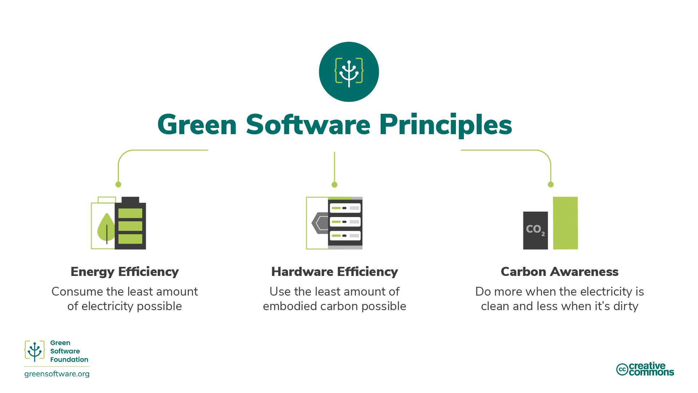
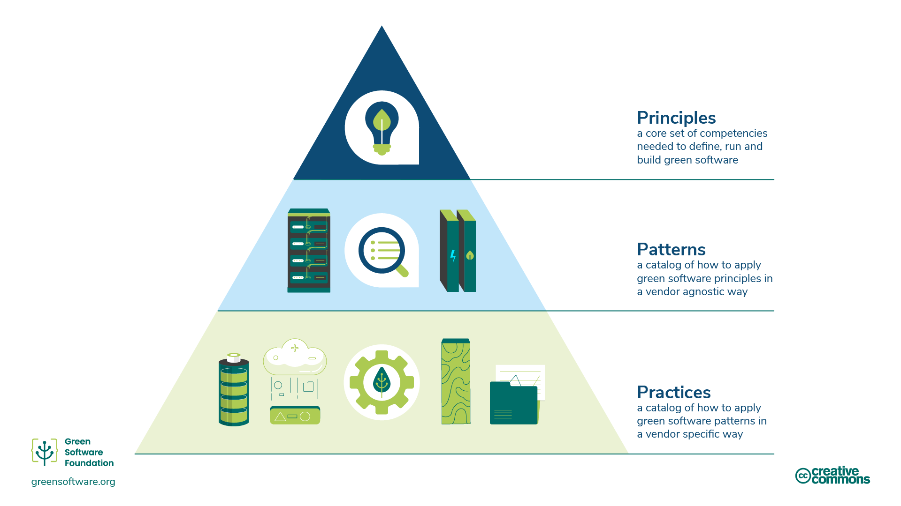

:::note
Đây là bản dịch cộng đồng đóng góp. Nó có sự hỗ trợ hạn chế và có thể không phù hợp với phiên bản tiếng Anh mới nhất của khoá học.
:::

## Phần mềm xanh là gì?

Phần mềm xanh là một ngành mới nổi tại giao điểm của khoa học khí hậu, thiết kế phần mềm, thị trường điện, phần cứng và thiết kế trung tâm dữ liệu.

Phần mềm xanh là phần mềm tiết kiệm carbon, có nghĩa là nó thải ra ít carbon nhất có thể. Chỉ có ba hoạt động làm giảm lượng khí thải carbon của phần mềm; hiệu quả năng lượng, nhận thức carbon và hiệu quả phần cứng. Khoá đào tạo này sẽ giải thích tất cả các khái niệm này, cách áp dụng chúng vào các quy trình và cách đo lường chúng, cũng như một số hướng dẫn và tổ chức quốc tế hướng dẫn, giám sát không gian này.

## Ai nên đọc bài viết này?

Bất cứ ai liên quan đến quá trình xây dựng, triển khai hoặc quản lý phần mềm. Bằng cách nghiên cứu các nguyên tắc này, một học viên phần mềm xanh có thể đưa ra các quyết định có tác động có ý nghĩa đến sự ô nhiễm carbon của các ứng dụng của họ.

## Lịch sử

Năm 2019, tám nguyên tắc ban đầu của kỹ thuật phần mềm xanh đã được phát hành. Bản cập nhật năm 2022 của các nguyên tắc này dựa trên phản hồi nhận được trong những năm qua, kết hợp một số nguyên tắc và thêm một bản mới liên quan đến việc hiểu các cam kết khí hậu.

## Làm thế nào để trở thành một chuyên viên phần mềm xanh

Khoá đào tạo sau đây bao gồm 6 lĩnh vực chính mà một học viên phần mềm xanh cần biết:

1. Carbon Efficiency: Phát thải lượng carbon tối thiểu có thể.
2. Energy Efficiency: Sử dụng lượng năng lượng tối thiểu có thể.
3. Carbon Awareness: Làm nhiều hơn khi điện sạch hơn và ít hơn khi có nhiều ô nhiễm hơn.
4. Hardware Efficiency: Sử dụng lượng carbon tiêu tốn tối thiểu.
5. Measurement: Cái gì không đo đạc được thì không thể cải thiện được.
6. Climate Commitments: Hiểu rõ cơ chế chính xác của việc giảm cacbon.

Mỗi chương sẽ giới thiệu một số khái niệm mới và giải thích chi tiết tại sao chúng lại quan trọng về mặt khí hậu, và làm thế nào bạn có thể áp dụng chúng vào thực tiễn phần mềm xanh của bạn.

## Nguyên tắc, Mô hình và Thực hành.

Các lĩnh vực và nội dung chính của khoá học này mô tả các nguyên tắc của phần mềm xanh, một tập hợp các năng lực cốt lõi cần thiết để xác định, chạy và xây dựng phần mềm màu xanh.

Phần mềm xanh [**pattern**] (https://patterns.greensoftware.foundation/) là một ví dụ cụ thể về cách áp dụng một hoặc nhiều nguyên tắc trong một ví thế giới thực. Trong khi các nguyên tắc mô tả lý thuyết củng cố phần mềm xanh, các mẫu là những lời khuyên thực tế mà các học viên phần mềm có thể sử dụng trong các ứng dụng phần mềm của họ ngày nay. Các mẫu là trung lập giữa người bán.

Phần mềm xanh ** thực hành** là một mô hình áp dụng cho sản phẩm của một nhà cung cấp cụ thể và thông báo cho các học viên về cách sử dụng sản phẩm đó theo cách bền vững hơn.

Thực tiễn nên đề cập đến các khuôn mẫu nên đề xuất các nguyên tắc.

Green Software foundation cũng xuất bản một [danh mục các mẫu phần mềm xanh trung tính của nhà cung cấp] (https://patterns.greensoftware.foundation/) trên nhiều hạng mục khác nhau.

